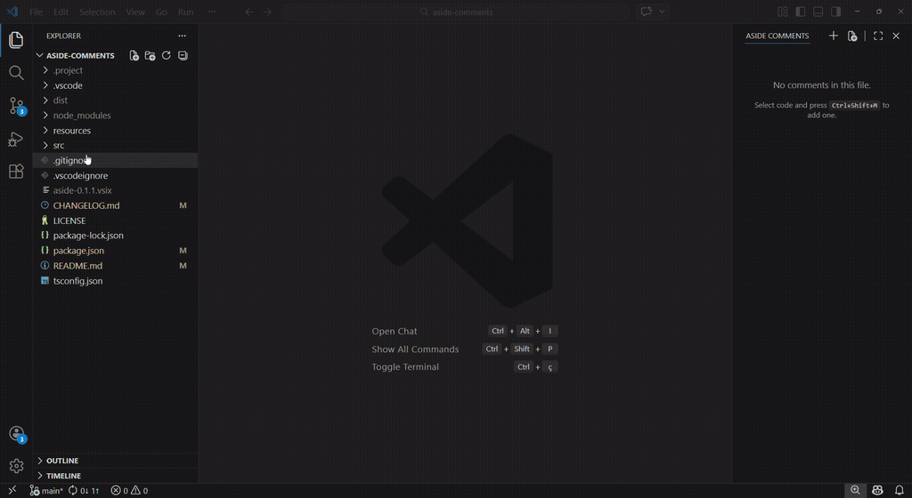

# Aside Comments

Word-style margin comments for VS Code. Add comments alongside your code without modifying source files.

## Demo

## Features

- **Line, file & folder comments** - select code and comment, or attach notes to an entire file or folder
- **Panel** - browse and edit all comments in a dedicated panel
- **Colored indicators** - gutter lines, background highlights, and scrollbar indicators with 8 presets + custom colors
- **File decorations** - files with comments show a badge (🗨) in the Explorer and Open Editors panels
- **Hover tooltips** - hover commented lines for quick preview with edit/delete links
- **Line tracking** - comments follow code as you edit, with fuzzy re-attach after external changes

## Getting Started

1. Select lines of code, a file, or a folder in the Explorer
2. Press `Ctrl+Shift+M` (`Cmd+Shift+M` on Mac) or right-click and choose "Add Comment", "Add File Comment", or "Add Folder Comment"
3. Type your comment, pick a color, and save

Comments are stored in `.aside/` files relative to your workspace. Add `.aside/` to `.gitignore` to keep them local, or commit to share with your team.

## Settings

| Setting | Default | Description |
|---------|---------|-------------|
| `asideComments.author` | `""` | Override auto-detected author name |
| `asideComments.storagePath` | `.aside` | Storage folder relative to workspace root |
| `asideComments.fuzzyMatchThreshold` | `0.7` | Similarity threshold (0-1) for re-attaching orphaned comments |
| `asideComments.showScrollbarIndicators` | `true` | Show color indicators in the scrollbar |
| `asideComments.showGutterLines` | `true` | Show indicators in the editor gutter |